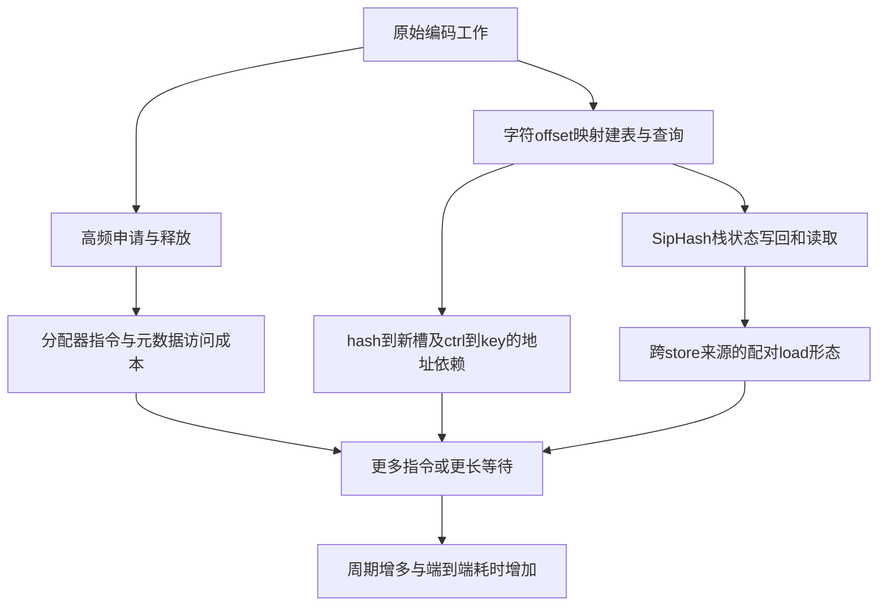

# Tokenizer 原始测试用例 Top-down 根因分析报告

**报告日期：2026-09-26｜对象：192.168.41.51 ARM 与 192.168.45.63 AMD｜依据：已完成实验与原始计数复核**

本报告汇总已有实测，不代表本次重新执行了一轮性能测试。结论适用于附件的固定输入、模型、重复预热编码场景。

## 1. 结论

原始 tokenizer 用例的主要成本来自**大量分配/释放，以及字符 offset 映射的建表、哈希、扩容和查询**。在 ARM 上，这些路径产生了更多指令或更长的访存依赖等待。已获得端到端因果证据的两个主要优化入口是：

1. **分配器及堆布局。** 应用发出的分配请求几乎相同，但当前 glibc 路径在两机的执行成本不同。换成同版本 mimalloc 后，ARM 已拆LDP版本的编码耗时再下降 **28.95%**，95%区间 **[28.45%,29.51%]**；两机每次编码的指令差由 **6.52% 缩至0.37%**。
2. **SipHash 中跨两个 store 来源的配对读取。** 两条不同写指令更新元数据，随后一条LDP跨这两个来源读取。在本机上，拆成两条LDR可避免这一不利读写形态；真实wheel端到端耗时下降 **3.70% [3.01%,4.43%]**。

进一步的匹配指令消融证明，**hash结果到新表地址的依赖链**也是重要的机制因素。它与上述局部读取代价相互作用，不能按独立时间占比相加。

在同一轮配对实验中，LDP拆分与mimalloc组合，使ARM原始编码耗时平均下降 **31.96% [31.32%,32.65%]**。考虑内存占用后，关闭测试进程的透明大页，ARM仍约 **26.36 ms**，RSS约 **164 MiB**。

**当前证据不支持将全部差距归因于NEON/SVE、PMOVMSKB、较小缓存或“ARM没有内存推测”。** 最终两机同用mimalloc、同样关闭THP后，ARM仍多 **16.08%** 的周期、IPC低 **13.52%**；这部分尚未唯一分解到芯片内部转发、重放或执行端口。

## 2. 用例、环境与统计口径

### 2.1 原始用例测量的工作

输入是一条文本：58834个字符、78960个UTF-8字节，预期输出25600个token。模型配置包含NFC归一化、正则Split、ByteLevel预分词、BPE及ByteLevel后处理。

原脚本保留一个tokenizer实例，重复相同文本并预热。`ThreadPoolExecutor(max_workers=8)`逐次提交后立即await，实际是**单请求串行**。计时表达式为：

```python
AutoTokenizer(...).input_ids
```

`tokenizer_ms`不含初始化、排队、输出IDs校验及每次10ms sleep。大部分后续PMU计数则覆盖整个原benchmark区域，包含暖机、校验、调度、sleep和统计输出，但排除导入、模型加载、单测和退出。睡眠本身不贡献退休指令或CPU执行周期；这两个统计区域仍不能混称为纯Rust encode。

重复输入有利于缓存复用，但**没有直接测量BPE缓存命中率**，不能认定每次BPE计算都被跳过。

### 2.2 对齐与未对齐条件

| 条件 | ARM `.51` | AMD `.63` |
|---|---|---|
| CPU | 鲲鹏920B / TaiShan V120 | EPYC 9654 / Zen4 |
| Rust / LLVM | 1.98.1 / 22.1.8 | 相同 |
| tokenizers / transformers / Python | 0.21.4 / 4.48.3 / 3.12.14 | 相同版本 |
| 真实热点使用的std hashbrown | 0.17.1，默认NEON8 | 0.17.1，默认SSE2-16 |
| 原始libc | glibc 2.34 | glibc 2.38 |
| C编译器 | GCC 12.2 | GCC 12.3 |
| 绑定 | CPU240,242,…254，NUMA3 | CPU80–87，NUMA1 |
| 频率策略 | performance，boost关闭 | performance，boost开启 |
| 基页 / PMD透明大页 | 64KiB / 512MiB | 4KiB / 2MiB |

原始请求中的hashbrown 0.15.3是早期独立应用侧实验对象；本报告涉及的真实offset热点已核实走统一工具链中的**标准库hashbrown 0.17.1**。这些结果不能直接视为0.15.3某一条load的性能结论。

两机CPU、OS/libc、频率策略及目标机器码仍不同，因此跨机差值不是纯ISA差值。报告以同机单变量对照建立因果，再用跨机同工作量计数解释差距。[环境及原用例证据](../x86_compare/comparison_report.md)

## 3. 第一层：硬件Top-down把方向指向后端执行与依赖

采用原版benchmark门控的ARM DevKit结果，与AMD原版PipelineL1统计；两者是各自工具模型下的分类，**不是相同公式下的可直接相减比例**。

| 一级指标 | ARM DevKit | AMD perf |
|---|---:|---:|
| Retiring | 45.86% | 59.80% |
| Backend Bound | 41.32% | 30.40% |
| Frontend Bound | 8.25% | 6.86% |
| Bad Speculation | 4.58% | 2.84% |

AMD还单列约0.10%的SMT contention；两机指标树及计算公式并不完全相同。

ARM后端继续下钻：Core Bound约 **30.53%**，Memory Bound约 **10.79%**，其中L3/DRAM Bound约 **2.21%**。结合重复采集与后续实验，支持优先检查执行依赖、状态读写和地址生成路径；没有显示大量DRAM等待是唯一主因。

Core Bound不等于已经证明某个执行端口饱和；Forward hazard等工具指标也不能直接解释成某条LDP消耗了多少周期。早期DevKit未逐事件输出复用率，已用较少事件分层复核；AMD L1/L2存在复用，并做了少事件专项复核。后续精确计数的100%覆盖率，不会补足早期工具的解释限制。[原始ARM分析](../wide/topdown_original_results.md)、[两机分层证据](../x86_compare/results/summary.json)

## 4. 第二层：软件热点及工作量来源

后续原版两机调用链采样给出的主要位置如下。这些是**采样周期占比**，不是精确阶段计时。

| 路径 | ARM | AMD | 口径 |
|---|---:|---:|---|
| 分配/释放相关函数 | 36.70% | 29.12% | self |
| offset映射建表 | 15.56% | 13.88% | 调用链inclusive |
| offset转换查询 | 7.06% | 4.95% | 调用链inclusive |
| hashbrown或offset路径并集 | 25.02% | 20.75% | 调用链去重 |
| libc拷贝 | 5.37% | 6.54% | self |

offset两行属于并集的一部分；分配器又服务于归一化、正则、Token/Encoding等多个阶段。**这些行不能相加，也不能把全部分配成本算进hashbrown。**

### 为什么没有请求offset输出，仍会出现这张表

核实的调用路径为：

```text
AutoTokenizer(...)
  → Python fast tokenizer encode_batch
  → Rust绑定 encode_batch_char_offsets
  → OffsetType::Char
  → BytesToCharOffsetConverter::new
      → char_indices / flat_map / HashMap::collect
      → 插入、增长、重哈希、搬迁
  → BytesToCharOffsetConverter::convert
      → HashMap::get，转换token边界
```

`BytesToCharOffsetConverter`把UTF-8每个字节位置映射到字符位置。当前调用即使没有要求返回`offset_mapping`，Rust绑定仍采用字符offset编码；Python输出选项没有取消Rust端的这项工作。

这解释了原始用例为什么不仅有BPE查找，还持续存在整张映射表的构建、扩容与查询。匹配该建表形状的受控模型有78960项初次插入、15次非空增长、114684项额外重哈希/迁移。后两项是受控模型计数，不应冒充真实RandomState进程每次调用的精确轨迹。

源码入口：[映射表构造与查询](../upstream/tokenizers/tokenizers/src/tokenizer/pre_tokenizer.rs)、[受控路径计数](../hb_rootcause/rootcause_report.md)。

## 5. 第三层：具体根因与验证链

### 根因A：高频分配触发了昂贵的分配器执行路径和不利的堆访问形态

**发生位置：**归一化、正则切分、Token/Encoding及临时容器构造、释放所共用的malloc/free/realloc路径。

**形成过程：**同一编码产生大量对象与缓冲区的申请、调整和释放。分配器需要定位尺寸类别、访问空闲链表及元数据、处理回收和必要的数据搬移。实现和堆布局不同，完成这些请求所需的指令、访存依赖与局部性也不同。

**工作量证据：**独立计数中，两机每次都是295605次malloc、35565次realloc、2次calloc、295606次free。malloc累计请求135244000/135244144字节，仅差144字节；realloc尺寸直方图完全相同。约92.96%的malloc请求不超过1032B。因此，明显差距不能用ARM应用发出了更多分配请求解释。

**因果证据：**两机换成同一源码、同一配置的mimalloc 2.4.4，ARM split耗时额外下降28.95%，AMD下降17.04%。ARM额外退休指令从6.52%缩至0.37%。非主线程分配微测也复现路径差异：

| 相同8B请求，先申请64个再释放 | ARM | AMD |
|---|---:|---:|
| glibc，cycles/malloc+free配对 | 90.81 | 43.03 |
| mimalloc，cycles/malloc+free配对 | 19.35 | 23.34 |

改换实现后，ARM在这个形状下反而更快。这支持“软件路径与访问形态”是关键因素，而非ARM所有分配或所有load天然更慢。

**结论强度：已确认重大端到端干预入口。** 分配器替换同时改变算法、目标代码和堆布局，尚未把glibc版本、GCC差异与物理布局各自的份额分离。[请求计数](../residual_mechanisms/allocation-summary.json)、[应用对照](../residual_mechanisms/allocator-summary.json)

### 根因B：SipHash元数据的写入来源与LDP读取范围不匹配

**发生位置：**`reserve/resize → hasher回调 → RandomState::hash_one → SipHash::write`，以及共享该usize哈希helper的其他调用。

设S为局部hasher状态基址，实际指令形状为：

```asm
str length, [S, #48]       // 写入S+48..55
stp tail, ntail, [S, #56]  // 写入S+56..71
...
ldp length, tail, [S, #48] // 读S+48..63，跨两个store来源
```

通用write没有内联进这个实际调用实例，状态仍通过栈内存写回再读出。配对load的两个半部来自不同store，形成了本机处理代价较高的读写关系。它与store-to-load forwarding或依赖处理受限一致，**具体是转发限制、等待还是重放，尚未从专用事件唯一判明**。

两种独立干预给出一致结果：

| 固定增长微测 | cycles/迁移项 |
|---|---:|
| 原写入与LDP | 83.42 |
| 读取拆为两条LDR | 60.57 |
| 写入改为匹配的STP，保留LDP | 60.52 |
| 两种改变一起做 | 60.51 |

匹配写入不减少退休指令，也获得同样改善；两者叠加几乎无额外收益。四种栈偏移控制仍复现，支持定位到这一读写形态，而非某个普通栈对齐点。

真实wheel中仅拆这处LDP，20组三版本端到端对照的平均耗时降幅为 **3.70% [3.01%,4.43%]**；同位置重定位但保留LDP的控制组没有显著变化。

**结论强度：具体代码形态及其应用收益已确认。** 正式落地方向是该局部代码生成或标准库实现调整；匹配write依赖“新hasher、单次usize输入”，仅用于诊断。该问题不是hashbrown控制字节的NEON Group::load。[读写形态实验](../growth_mechanism/report.md)、[真实wheel验证](../e2e_pair_load/report.md)

### 根因C：hash结果到目标桶、控制字节到候选key的依赖链限制重叠执行

增长路径为：

```text
旧桶key → hash计算 → 新ctrl地址 → 寻找空槽 → 更新ctrl → 搬迁条目
```

查询路径为：

```text
hash → ctrl读取 → mask/候选下标 → 桶地址 → 完整key读取与比较
```

后一步地址依赖前一步结果。即使控制字节已经向量化，CPU仍需要等待依赖值，才能开始后续读取。增加向量宽度不会自动消除这一链条。

直接克隆实验保留原栈帧、write调用和完整hash计算；两组都预读同一正确hash，仅以一条NOP/MOV选择最终返回值来源，退休指令数和结果相同。ARM匹配增长从67.92降至58.73 cycles/项，配对降幅 **13.34% [12.52%,13.96%]**；AMD没有显著改善。两机单独hash计算也没有显著变化。说明代价出现在计算结果与后续访问的组合中。

查询消融同样支持候选key依赖的重要性：固定组宽、同布局大表中，真实key回调为ARM31.23/AMD23.42 cycles/query；诊断性省去key读取后为11.72/14.37，优劣反转。

**结论强度：受控模型中的依赖敏感性已确认，独立端到端份额未量化。** oracle预读和省略key读取不能部署为普通HashMap；13.34%是匹配诊断变体内的收益，不是生产收益预测。oracle本身引入开销，不能用它与原版绝对值任意相减。[直接依赖消融](../residual_mechanisms/more-summary.json)、[查询消融](../hb_rootcause/rootcause_report.md)

## 6. 为什么SVE替换没有带来预期整体收益

现有证据形成如下逻辑链：



图示是代码及机制关系，不是百分比加和树。分配器、配对读取和地址依赖之间存在重叠与交互。

NEON/SVE控制组替换只改变了其中的控制字节扫描部分，没有消除分配请求、SipHash计算、上述状态写读、key访问或条目搬迁。固定工作量的增长模型中，寻空槽本就接近每项一个组，单纯加宽组没有大量额外探测可省。

x86的hashbrown查询确实使用SSE2和PMOVMSKB，但没有单独证明这条指令是整体差距的主要来源。整个x86程序还有libc运行时选择的AVX512拷贝路径，不能把“hashbrown使用SSE2”推广成“整个程序只使用SSE2”。

## 7. 已检验的替代解释，以及THP的正确定位

| 解释 | 实验结果 | 可以得到的结论 |
|---|---|---|
| ARM普通load总是慢、缓存更小 | 16KiB随机依赖链两机约4周期；256KiB ARM10.04/AMD14.11；其他大小互有优劣 | 不支持统一的普通load/缓存容量解释 |
| ARM不利用内存推测 | 两机同二进制在进程级禁用相关推测后均会变慢，程度随访问形态改变 | 两机都利用相关能力；同API不等于同硬件关闭范围 |
| 加大glibc线程缓存即可解决 | tcache_count=4096使ARM与AMD均变慢，部分同机L1/dTLB事件增加 | 堆布局与局部性重要，增大缓存并非本输入有效方案 |
| 线程池排队或并行设置是主因 | 原脚本串行await；Rayon=1或关闭内部并行对ARM无显著改善 | 当前单文本输入没有这项主要收益 |

**THP是优化候选的内存代价与配置问题，不能直接列为原版ARM慢的主因。** 默认mimalloc在ARM上触发了512MiB透明大页，RSS快照约675.5MiB；关闭该进程THP后约163.9MiB。原版ARM glibc快照没有这512MiB大页。

关闭THP后，ARM mimalloc周期变化约+0.87%，区间包含零，仍保留约28%的分配器周期收益。两个平台都关闭THP后收益仍在，说明主要改进不是仅由大页带来。`MIMALLOC_ALLOW_THP=0`也验证了低RSS结果。上述修改均限于测试子进程。[页策略与内存证据](../residual_mechanisms/report.md)

## 8. 端到端结果与剩余差距

### 8.1 同一主矩阵中的效果

| ARM配置 | 编码p50中位数 |
|---|---:|
| 原版glibc | 38.343 ms |
| 仅拆LDP | 36.853 ms |
| 仅换mimalloc | 27.660 ms |
| 拆LDP＋mimalloc | 26.288 ms |

组合相对原版的**配对平均耗时降幅为31.96% [31.32%,32.65%]**。各进程p50的中位数与逐块比值平均是不同统计量，不能由表中两个中位数相除复算该百分比。

### 8.2 两机统一分配器、关闭THP后的状态

| 指标 | ARM拆LDP＋mimalloc＋THP off | AMD原版wheel＋mimalloc＋THP off |
|---|---:|---:|
| 指令/区域编码 | 226.616 M | 225.757 M |
| 周期/区域编码 | 78.090 M | 67.275 M |
| 整体IPC | 2.902 | 3.356 |
| 编码p50中位数 | 26.355 ms | 17.899 ms |

指令量只差约0.38%，周期仍多16.08%，所以ARM的IPC低13.52%。恒等式为：

`IPC_ARM / IPC_AMD = (指令/工作量)_ARM / (指令/工作量)_AMD ÷ [(周期/工作量)_ARM / (周期/工作量)_AMD]`

这时全应用指令总量已接近，剩余差距主要表现为完成这份工作所需周期较多；墙钟差还受到约2.9GHz与约3.7GHz活动频率的影响。IPC百分比不能替代耗时百分比，两个平台同条数指令也不代表完全相同的机器操作。

在默认mimalloc条件下重新做的平面采样，剩余正差仍主要位于分配器self、reserve、insert与offset查询，正则与拷贝还有较小差异。该采样不是最终THP-off配置的全层Top-down，也不是精确函数IPC。[剩余路径采样](../residual_mechanisms/profile-summary.json)

## 9. 优化归属与尚未闭环的部分

| 优先级 | 修改位置 | 当前依据 | 当前状态 |
|---|---|---|---|
| 1 | 进程分配器及THP策略 | 约29%额外耗时收益，低RSS方案验证 | 有应用实测；尚非生产多负载验证 |
| 2 | AArch64代码生成或标准库SipHash局部实现 | 具体LDP读写形态与3.70%应用收益 | 诊断wheel验证；待形成正式编译产物 |
| 3 | hashbrown建表、查询及依赖调度 | 微测依赖消融、真实热点 | 有机制证据；收益需在真实wheel重新验证 |
| 条件性方向 | tokenizer字符offset转换设计 | 源码确认持续建表与查询工作 | 可研究按需转换或其他映射结构，须保持完整Encoding语义，未实现计时 |

如果仍限定只修改hashbrown源码，分配器收益不在该范围内；SipHash属于标准库哈希实现，单改Group::load无法覆盖这处具体问题。

尚未独立量化的项目：glibc版本与目标代码生成各自份额、真实分配生命周期/跨线程释放贡献、正则及拷贝各自的单变量端到端收益、V120内部forwarding/replay/执行端口的精确份额。

完整报告结构已经覆盖主要路径，但还缺：**stock与最终低RSS配置在同一窗口下的完整Top-down分层重采，以及按需要补充的软件阶段独立计数。** 当前报告不把剩余13.52%强行分成可加的“根因百分比”。

## 10. 证据、验证与复现

- 原版Top-down：[跨机报告](../x86_compare/comparison_report.md)、[原始汇总](../x86_compare/results/summary.json)。
- Hashbrown工作量及查询：[路径报告](../hb_rootcause/rootcause_report.md)。
- 配对load机制：[微测报告](../growth_mechanism/report.md)、[真实wheel报告](../e2e_pair_load/report.md)。
- 分配器、依赖、页策略及排除实验：[综合实验报告](../residual_mechanisms/report.md)、[脚本与原始证据包](../tokenizer_residual_rootcause_20260926.tar.gz)。
- 测量覆盖与缺口：[结构覆盖审计](../topdown_coverage.md)。
- 本报告数值来源及SHA256：[事实清单](tokenizer_topdown_report_facts.json)。

最新根因扩展批次共890次计数、2048条事件记录，均100%运行；23040次正式编码、7140次暖机输出校验通过。LDP独立应用批次另有20组三版本对照、112320次哈希参考校验和12个完整Encoding校验。不同批次不混合统计、不把微测比例直接当作应用收益。

原stock、fixture、测试源码和系统全局配置未修改。当前LDP克隆wheel未补齐异常展开元数据，oracle实验也仅用于诊断；二者均不作为生产制品交付。

## 11. 为什么IPC仍低，下一步怎样改善

最终低RSS对照中，两机都约执行2.26亿条用户态指令；ARM耗费约7809万周期，AMD约6727万周期，得到IPC约2.902和3.356。继续优化的目标应是减少每次编码的周期和耗时，不能单独追求更高的IPC：若删除的指令比删除的周期更多，程序变快时IPC也可能下降。

目前优先排查的仍是分配器真实混合请求下的元数据访问，以及offset表的扩容、插入和查询。默认mimalloc条件的采样估算中，三类表操作self合计ARM约16.69M、AMD10.57M周期/区域编码；分配器约10.24M/5.78M。可识别hash函数self反而约3.54M/4.61M，因此不能把当前剩余差距全部归给SipHash本体。这些数字用于排序，不能精确分账最终THP-off配置的13.52%。

以下是待验证的具体方案，尚未产生新的性能结果：

| 顺序与适用范围 | 具体改变 | 要减少的工作 | 首要验证 |
|---|---|---|---|
| 优先：允许修改tokenizer内部实现 | 将byte→char映射的稠密整数键HashMap改为连续`Vec<usize>` | 取消该映射的hash、探测、rehash和key比较；查询按字节下标直接读取 | 完整Encoding字段、UTF-8多字节字符、NFC相关offset、空输入及末尾fallback语义；原用例配对计时 |
| 仅限编译器/标准库或hashbrown时优先 | 对真实wheel分别验证CGU=1、ThinLTO、局部内联/固定8B输入路径 | 减少`hash_one→write`调用、通用状态管理和栈往返 | 先确认真实汇编发生预期变化，再测试；此前B1微测收益未传入真实wheel，不能复用该收益预测 |
| 允许改变内部缓冲管理 | 记录真实分配的尺寸、生命周期和alloc/free线程归属，再针对高频临时缓冲做容量预留或安全复用 | 减少malloc/realloc/free调用及搬移；改善堆访问形态 | 分配调用数/字节与复制量是否下降，完整输出和RSS是否保持，端到端是否获益 |
| 保留HashMap设计 | 对增长循环预留容量、调整哈希与搬迁调度，或重叠多个候选访问 | 减少重哈希或隐藏串行等待 | 固定组宽、相同hash及结果；逐项检查探测/迁移工作量和panic安全，最后真实wheel验证 |

稠密数组方案有直接的数据结构依据：当前实现为每个UTF-8字节位置插入一个key，因此键覆盖`0..sequence.len()`，并不需要一般稀疏哈希表的寻址能力。在本输入上，78960个`usize`约需0.60MiB元素存储；原对应表的桶与ctrl约2.1MiB。这里仅比较这张映射表，不是全进程RSS或收益预测。实现必须保留当前末尾offset缺项时的fallback行为，不能直接删掉字符offset计算或改变公开Encoding语义。

如果维持“只改hashbrown”的限制，连续数组和缓冲复用不属于该范围，应先做真实编译上下文的内联/状态消除实验。调整线程数、扩大tcache或继续单独加宽控制字节load，目前均没有支持它们成为本用例下一优先项的证据。

## 12. 同用mimalloc后，ARM是否仍执行了很多额外指令

需要分开看整体与局部。最终mimalloc、THP关闭配置中，整个benchmark区域的指令是ARM226.616M、AMD225.757M，仅差0.38%；周期却相差16.08%。当前整体性能差主要体现为周期成本，不是大量额外指令。

部分分配微测确有较多ARM指令。新核验的实际mimalloc库SHA与已测产物一致；对`mi_malloc`/`malloc`/`__libc_malloc`的同地址别名按地址反汇编。在请求不超过1024B、空闲链表非空的这条返回路径中，本构建ARM为19条架构指令，AMD为16条，不含调用者/PLT和free。

具体差异包括：

- 获取线程局部heap：ARM使用ADRP、LDR、MRS TPIDR_EL0和另一条LDR；AMD使用RIP相对MOV和FS相对MOV。
- 选择page：本构建ARM显式计算一个附加偏移；AMD把该偏移放入内存寻址操作数。
- 更新page的16位计数器：ARM使用`LDRH → ADD → STRH`，AMD使用`ADDW $1, 0x20(%rax)`一条带内存操作数的读改写指令。
- ARM的CBZ又能将空值测试与条件分支合为一条。因此应比较完整路径，不能只累计对ARM不利的片段。

同源同版本不等于同机器码；上面是ISA表达方式及本次目标代码生成的具体差异。一条带内存操作数的指令仍需完成实际的读取、计算和写入，退休指令条数不能直接当作周期成本。

实测反例很明确：mimalloc的8B/64批次分配释放微测，ARM每对70.20条指令、19.35周期，AMD58.21条指令、23.34周期。ARM指令约多20.6%，反而约少17.1%周期。2048B逐个申请释放时，ARM260.20条/74.68周期，AMD232.77条/55.82周期，优劣又不同。两者包含测试循环与指针数组开销，不是单独malloc函数的动态计数。

因此，不能把小对象快路径的指令差直接外推成真实混合负载的总性能差。此前分配器self的10.24M/5.78M是采样估算的周期，而非指令数；当前未通过独立函数计数证明真实应用mimalloc自身的指令也相差相同比例。

本次核验原始输出：[ARM快速路径](mimalloc_arm_fastpath.asm.txt)、[AMD快速路径](mimalloc_x86_fastpath.asm.txt)、[二进制身份和指令计数证明](mimalloc_fastpath_proof.json)。没有新增性能运行。

## 13. 后续真实分配轨迹验证：对剩余allocator差距的解释进一步收窄

随后新增246次有效PMU计数、6份真实接口轨迹和通用入口计数。两机每次626778个分配接口事件均发生在同一线程，生命周期关系相同，记录内跨线程释放为0；归一化后的跨机差异只有18次申请及对应free的8B尺寸差。mimalloc通用入口中位26166/26163次，周期性维护262/262次，没有发现ARM显著更频繁进入这些入口。

同一完整请求轨迹回放的结果随payload触碰方式改变；空驱动对照也显示框架自身存在架构差异。由此不能把原应用采样allocator self的10.24M/5.78M理解成mimalloc在同一请求下固有地慢约一倍，也不能反过来依据某一回放结果断言ARM allocator必然更快。原业务访存、驻留堆、生成代码及采样归属仍需区分。

新确定的业务来源是Oniguruma `match_at`结束时的`STACK_SAVE`：每次编码20765次5136B申请，随后按该容量复制到堆上，累计106649040B，占malloc申请字节78.86%。这是一处频繁的临时工作缓冲保存，不代表相同比例的时间占用。

保留正则算法和全部复制、仅对该位置复用一块内存的诊断，ARM相对同开销转发控制快0.847%，但相对没有诊断层的mimalloc基线反而慢0.805%。没有得到可直接部署的ARM净收益。后续应在源级研究工作缓冲和保存条件，不能直接删除保存或复制，因为失败重试等正则语义尚需验证。

详见[真实轨迹、回放、驱动控制与应用验证报告](../allocator_trace/report.md)。本节更新了第7、11、12节中尚待验证的分配请求、线程归属及调用频率问题，不改变此前已验证的LDP和分配器替换收益。
